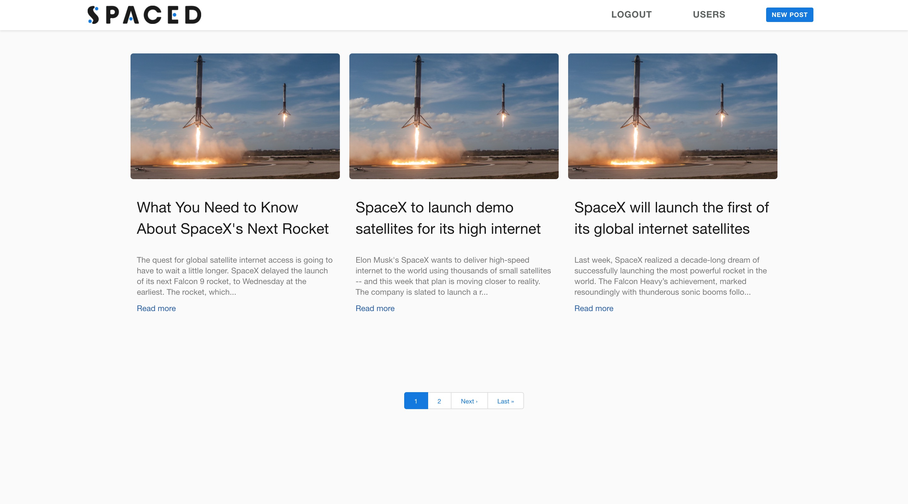

# Simple blog platform about Space
> First ruby on rails project





* Ruvy
2.4.0

* Rails
5.1.5

* Deployment instructions

```
cd space-blog
bundle install
rails s
```

## Enjoy
- [Go to localhost:3000](http://localhost:3000)
- [See the online version](https://space-blog.herokuapp.com)


## Authors
Back-end developer : Johann Desobry
[@johannDesobry](https://github.com/JohannDesobry)

Front-end developer : Antoine de la Fouchardière
[@antoinedlf](https://github.com/antoinedlf)


## Built with
- Bitbucket
- Bulma CSS
- Heroku
